# FSociety AI System Flows

## Content Moderation Flow

## Authentication Flow

## Data Processing Flow

## Analytics Flow

## User Management Flow

## Content Review Flow

## System Integration Flow

## Error Handling Flow

```mermaid
graph TD
    A[Error Detected] --> B{Error Type}
    B -->|Validation| C[Show User Message]
    B -->|System| D[Log Error]
    B -->|Network| E[Retry Logic]
    D --> F[Alert Admin]
    E --> G{Retry Success?}
    G -->|Yes| H[Continue Process]
    G -->|No| I[Fallback Action]
```

